Redhat Enterprise Linux Install
======

1. 选择安装

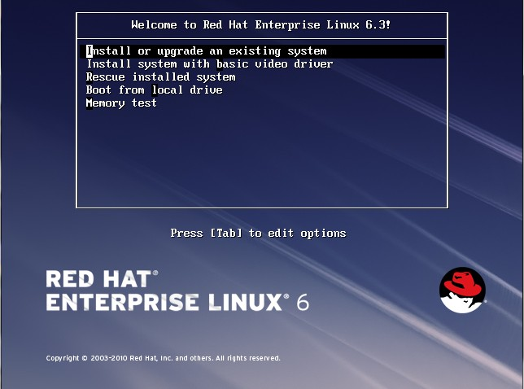

2. 选择安装语言 English

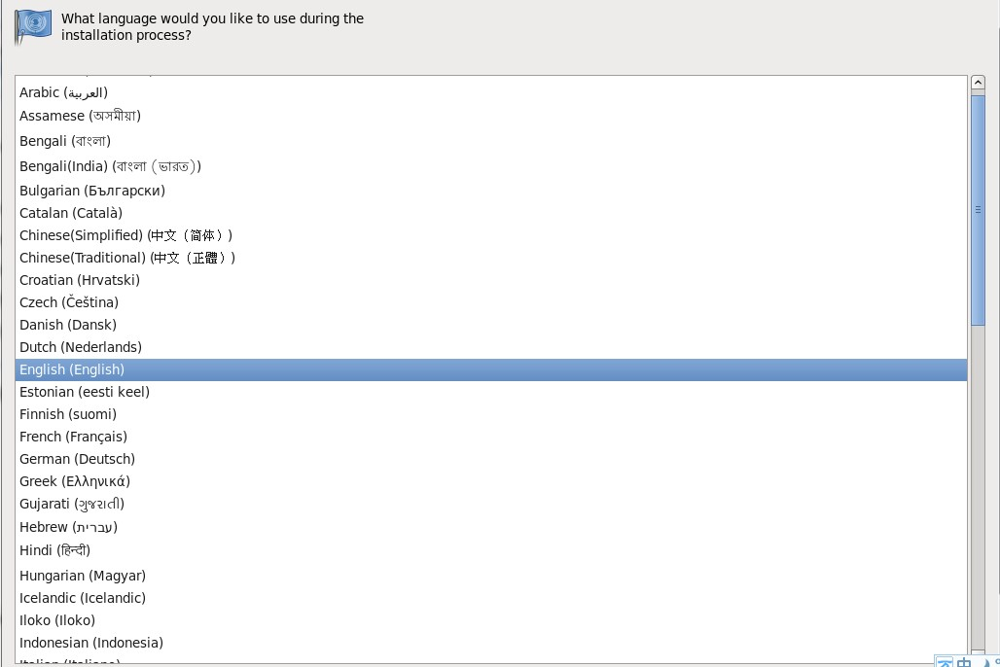

3. 选择存储空间

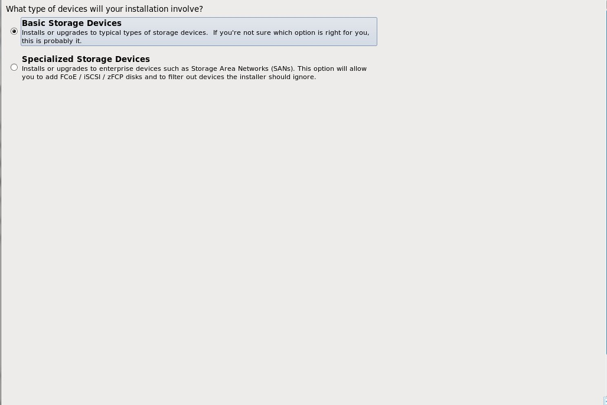

4. 选择“YES”

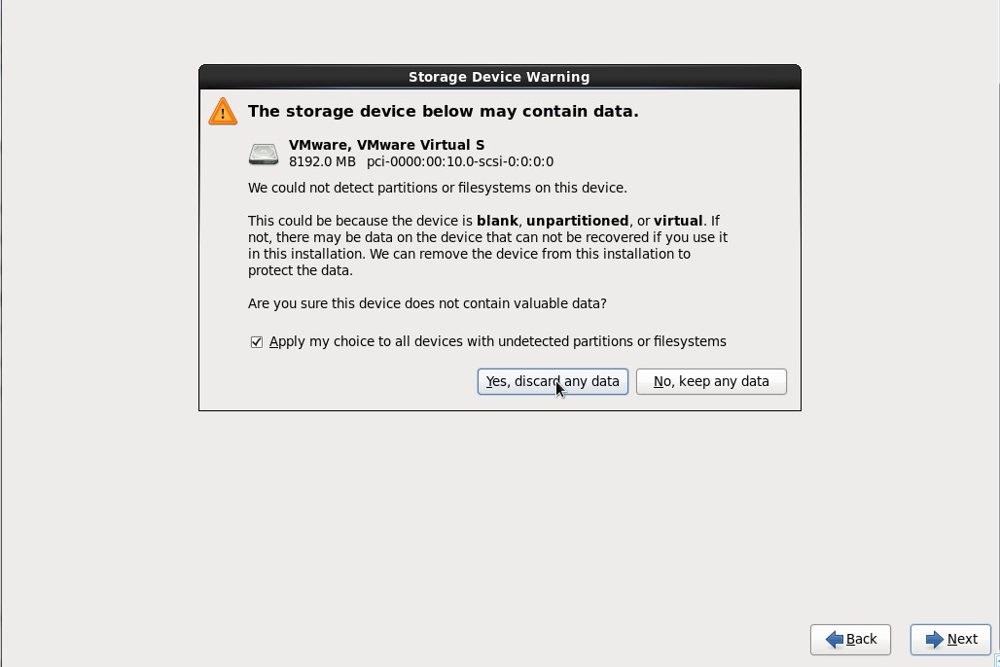

5. 修改“Hostname”，设置IP地址(eth0)

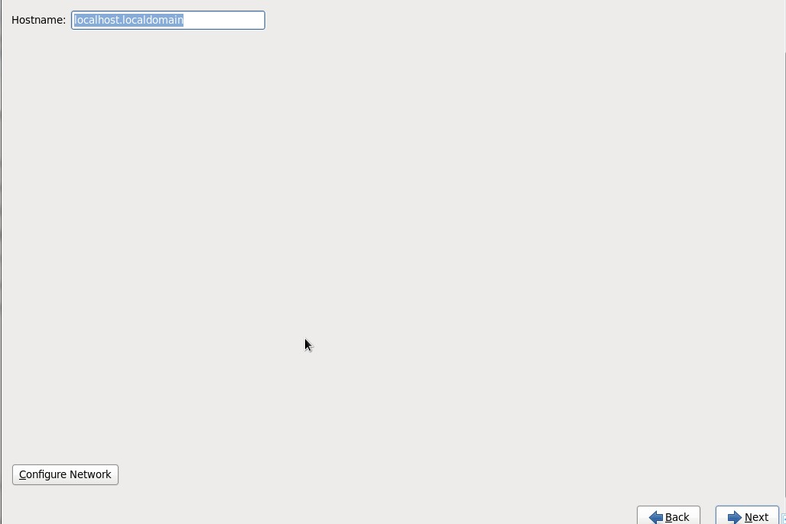

6. 选择时区“Asia/ShangHai”

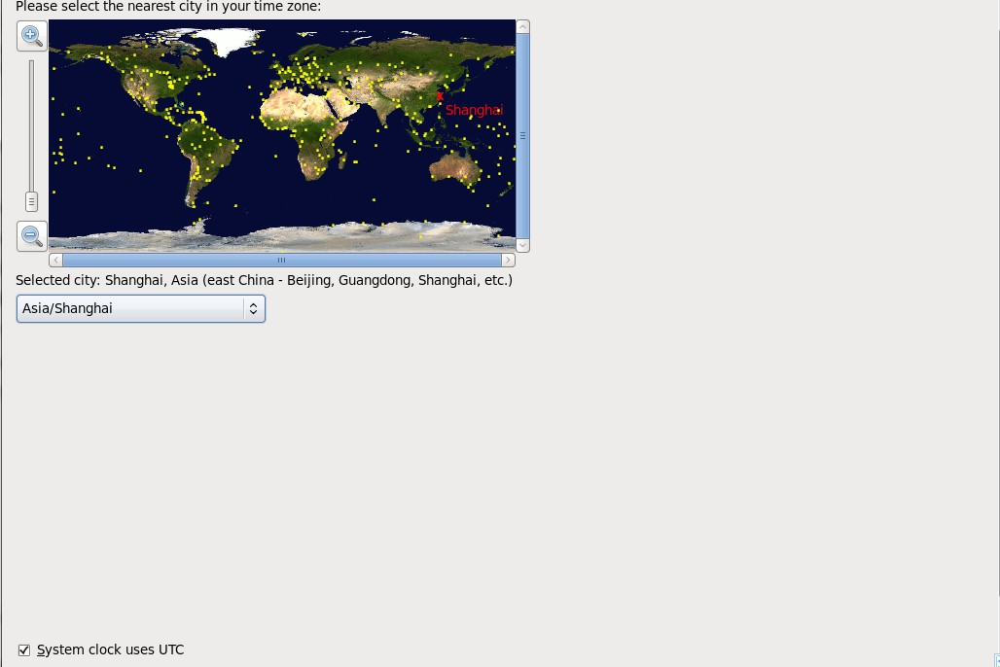

7. 磁盘分区

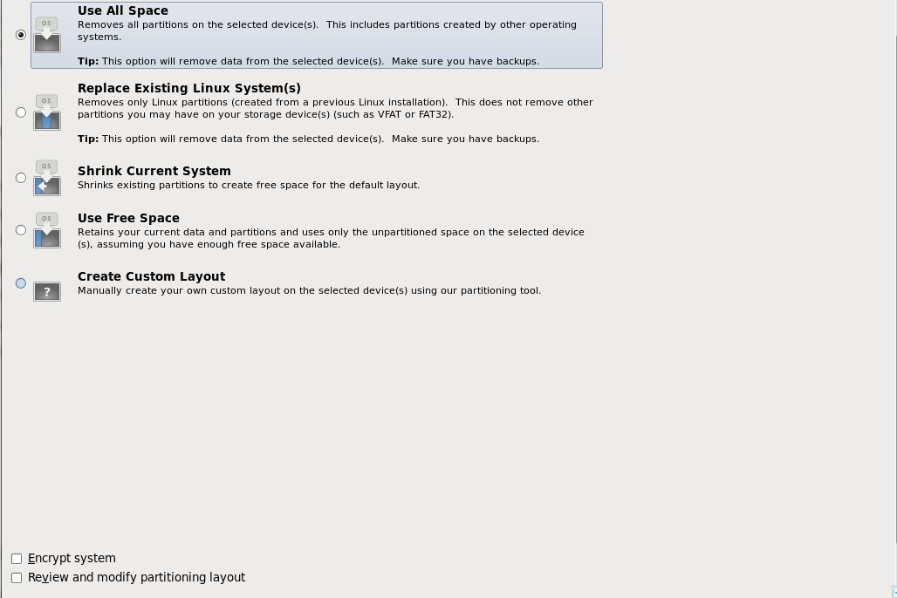

8. 选择安装软件，“Desktop”，“Load Balancer”，“Customize Now”

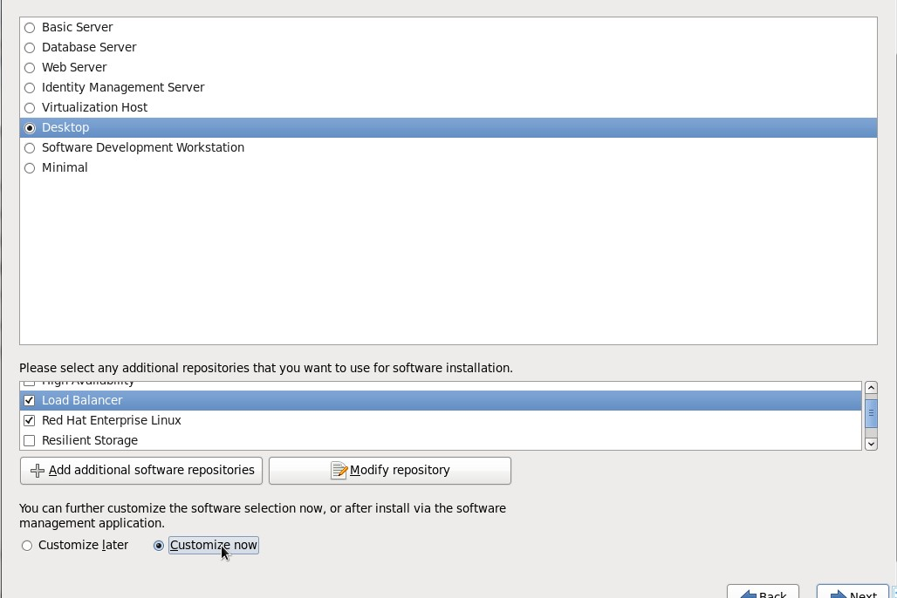

9. 选择“Web Services”，勾选“PHP Support”，“Web Server”，把Apache安装上

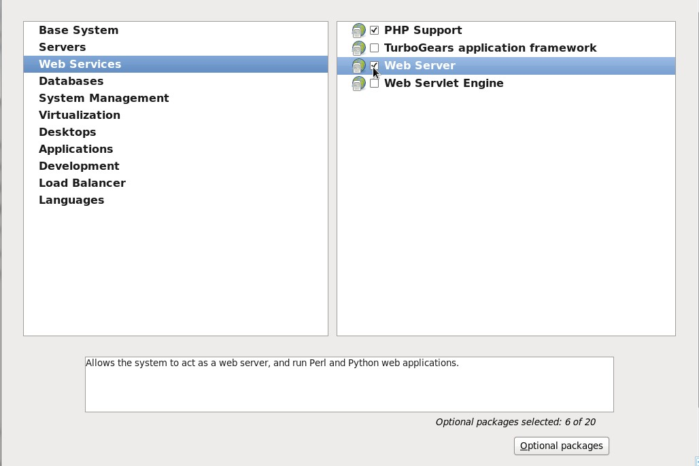

10. 选择“Development”，勾选“Development Tools”，把GCC安装上

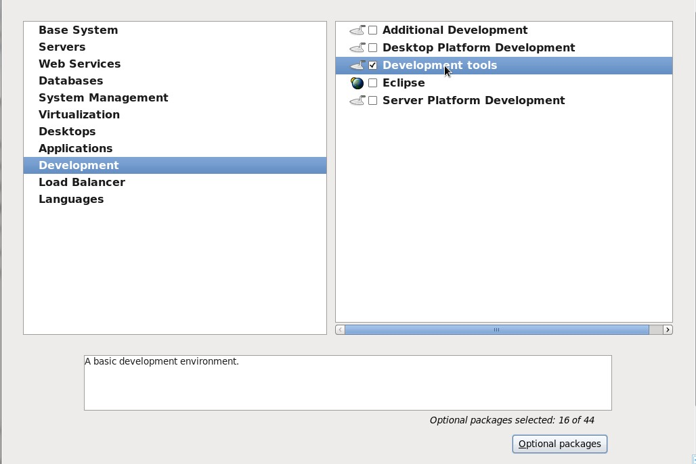

11. 选择“Load Balancer”，勾选“Load Balancer”，把LVS安装上

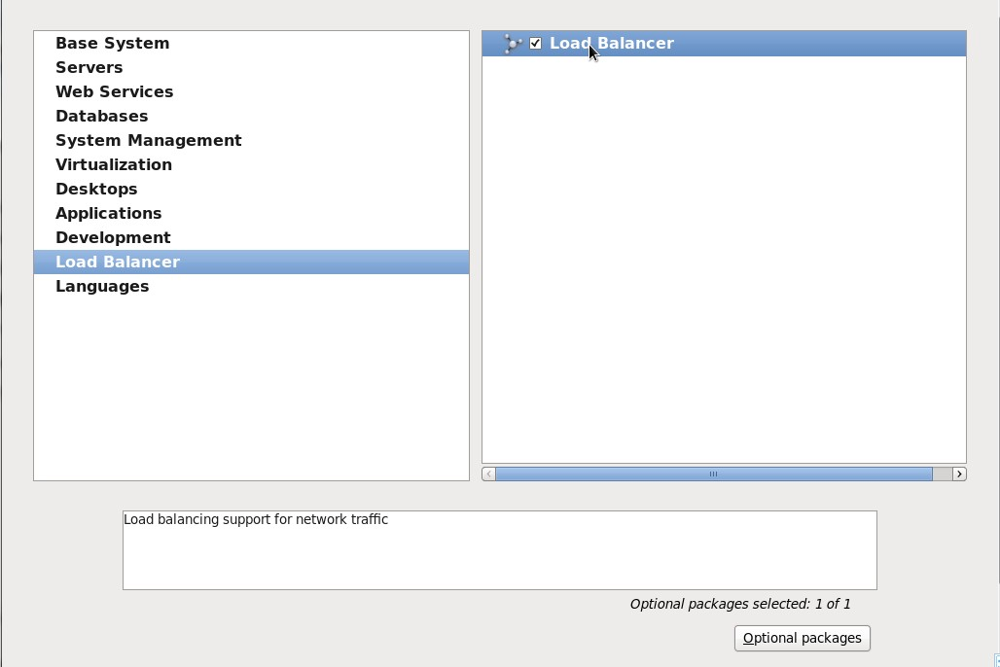

12. 选择“Languages”，勾选“Chinese Support”，把中文支持安装上

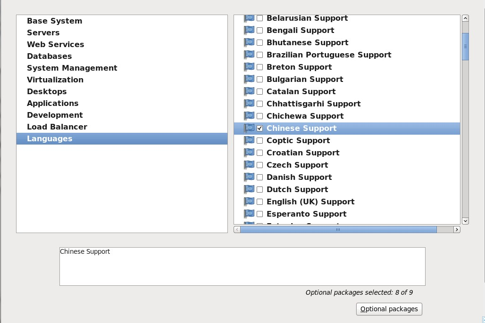

